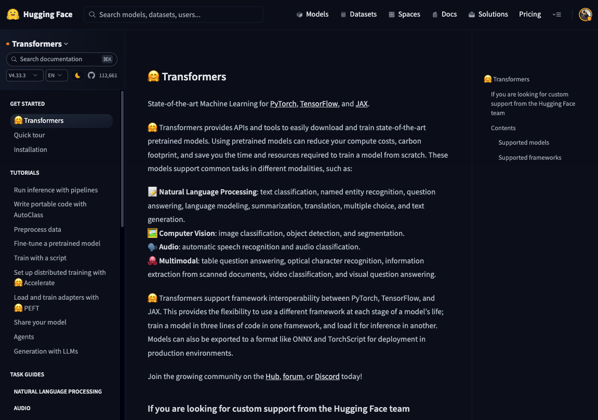
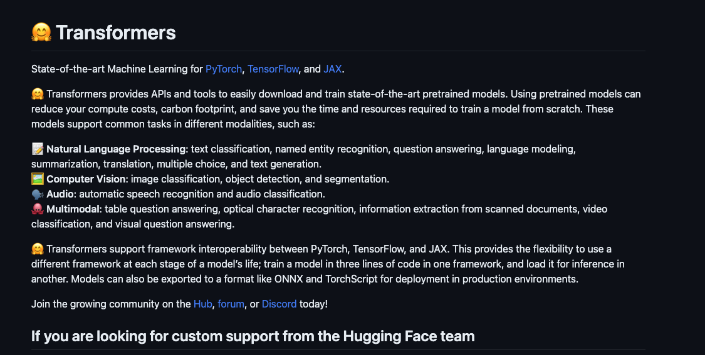

# Clipper

Clipper is a Node.js command line tool that allows you to easily clip content from web pages and convert it to Markdown. It uses [Mozilla's Readability library](https://github.com/mozilla/readability) and [Turndown](https://github.com/mixmark-io/turndown) under the hood to parse web page content and convert it to Markdown.

Clipper provides a quick and simple way to save bits of content from the web for personal archival or note taking purposes, similar to browser extensions like Evernote Web Clipper or Notion Web Clipper. However, Clipper runs entirely in the terminal so you don't need to install any extensions or sign up for accounts.


| HTML                                   | Markdown                                       |
| -------------------------------------- | ---------------------------------------------- |
|  |  |

## Installation

```
npm install -g @philschmid/clipper
```

## Usage

### Clip

**Options:**

- `-i, --input <file>` - Input file (html) to clip content from
- `-u, --url <url>` - URL to clip content from
- `-f, --format <format>` - Output format (markdown, json) (default: markdown)
- `-o, --output <file>` - Output file for clipped content (default: output.md)


**Examples:**

1. Clip content from a URL:

```
clipper clip -u <url>
```

2. Clip content from a file:

```
clipper clip -i <file>
```

### Crawl 

> [!WARNING]  
> Only use this command if you know what you're doing. Crawling websites can be resource intensive and may cause issues for the website owner. Use at your own risk.

**Options:**

- `-u, --url <url>` - URL to crawl
- `-g, --glob <glob>` - Glob pattern to match URLs against
- `-o, --output <file>` - Output file for crawled content (default: dataset.jsonl)

**Examples:**

Crawl a site and clip all pages:

```
clipper crawl <url>
```

Results will be saved in `dataset.jsonl` file in the current directory.


## Local Development

- Clone the repo
- Run `pnpm install`
- Run `pnpm run test clip -u https://huggingface.co/docs/transformers/index` to test the CLI
- Run `pnpm run test crawl -u https://awsdocs-neuron.readthedocs-hosted.com/en/v2.14.1/index.html -g https://awsdocs-neuron.readthedocs-hosted.com/en/v2.14.1/\*\*/\*` to crawl the AWS Neuron docs
- Run `pnpm run build` to build for production
- Run `clipper clip -u https://huggingface.co/docs/transformers/index` to build for development
- Run `pnpm install -g .` to symlink the CLI for local testing
- Remove the symlink with `pnpm r clipper -g`
## Credits

Clipper uses the following open source libraries:

- [Mozilla Readability](https://github.com/mozilla/readability) - For parsing article content
- [Turndown](https://github.com/mixmark-io/turndown) - For converting HTML to Markdown  
- [Crawlee](https://crawlee.dev/) - For crawling websites

## License

* Apache 2.0


## Release to npm

1. Remove old build files with `rm -rf dist`
1. Update the version in `package.json` if minor or major version
2. Run `npm run build`
3. Run `npm publish --access public`
4. Create a new release on GitHub
5. Update the version in `package.json` to the next patch version